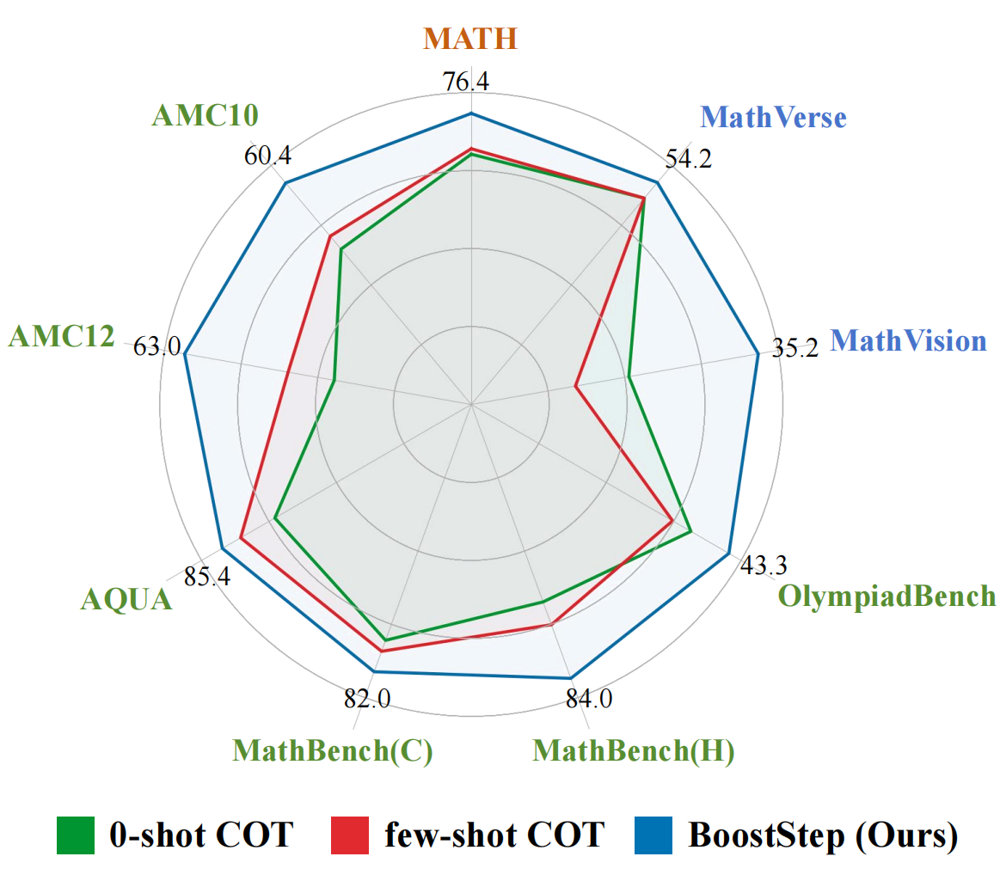
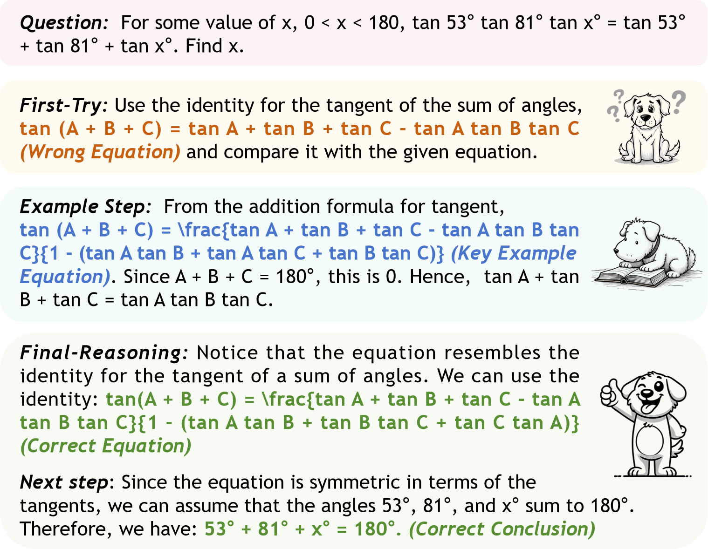

# BoostStep
This repository is the official implementation of [BoostStep](https://arxiv.org/abs/2501.03226)

**BoostStep: Boosting mathematical capability of Large Language Models via improved single-step reasoning**\
[Beichen Zhang](https://beichenzbc.github.io), [Yuhong Liu](https://beichenzbc.github.io), [Xiaoyi Dong](https://lightdxy.github.io/), [Yuhang Zang](https://yuhangzang.github.io/), [Pan Zhang](https://panzhang0212.github.io/), [Haodong Duan](https://kennymckormick.github.io/), [Yuhang Cao](https://scholar.google.com/citations?user=sJkqsqkAAAAJ&hl=zh-CN&oi=sra), [Dahua Lin](http://dahua.site/), [Jiaqi Wang](https://myownskyw7.github.io/)

## 💡 Highlights
- 🔥 **Step-level Example Problem Bank** We develop a step-level example problem bank according to reasoning content instead of grammatical separation

- 🔥 **Step-level In-context Learning** We align the granularity between the retrieving and reasoning on step grained and provides highly related ICL examples for each reasoning step with a novel `first-try' strategy

- 🔥 **Strong Performance** We improve GPT-4o and Qwen2.5-Math-72B by 3.6\% and 2.0\% respectively on various mathematical benchmarks comparing to problem-level few-shot learning, and further obtain 7.5\% gain combined with MCTS.

  

## 📜 News
🚀 [2025/1/7] The example problem bank and the AMC test set are released
🚀 [2025/1/7] The paper is released!

## 🛠️ Usage

We will soon release our code of step-level in-context learning with first-try strategy.

## ⭐ Demos

  

Here we demonstrate a specific example. Given the question, we first let the model to have a first-try on step one. Unfortunately, the model makes an error on tangent sum formula, therefore leading to a wrong step. Then, we find a similar step which correctly leverage tangent sum formula in the step-level example problem bank according to this first-try. Therefore, with the guidance provided, the model correctly applied the tangent sum formula during the second reasoning attempt and arrived at the correct answer.

## Citation
If you find our work helpful for your research, please consider giving a star or a citation, thanks!
